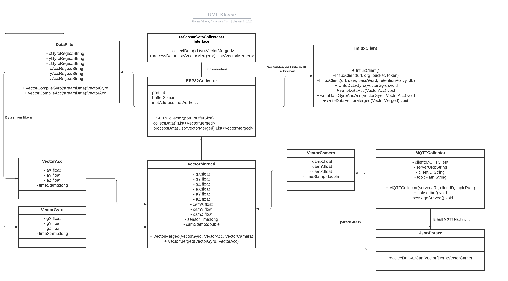

# Jannotator
Dieses Program ermöglicht die Erfassung von Sensordaten (MPU-9250)
und Annotierung dieser Daten mit Positionsdaten aus einem externen System.
Für den ESP32 Code bitte diesem Link folgen: Link
Für die Anomalien Detektion diesem Link folgen: Link

## Architektur 

## Technologien

Sprachen:

    * Java

Frameworks:

    * Maven
    * MQTT Library
    * Java Influx API

## Voraussetzungen

    * JDK Version 8
    * Maven 3.6.3
    * Zugriff auf eine Influx Datenbank
    
## Maven Installation
Bevor das Programm genutzt werden kann ist es wichtig, dass Maven 
auf dem Rechner installiert ist. Dazu kann man diesem Link folgen wo
erklärt wird wie man Maven und die JDK installiert. Des Weiteren wird 
auch erklärt wie man die PATH Variablen jeweils richtig setzt.

